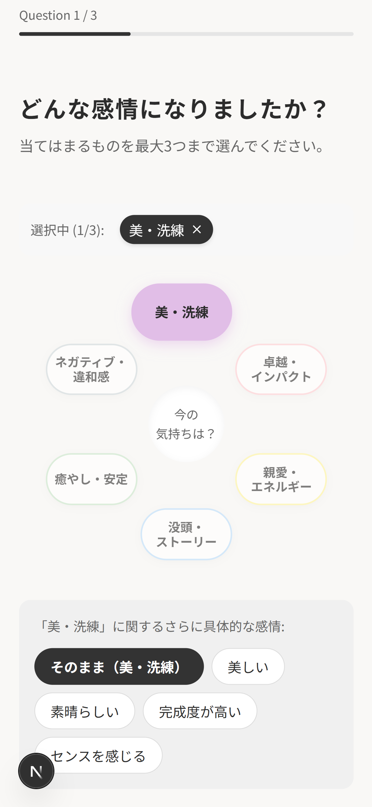
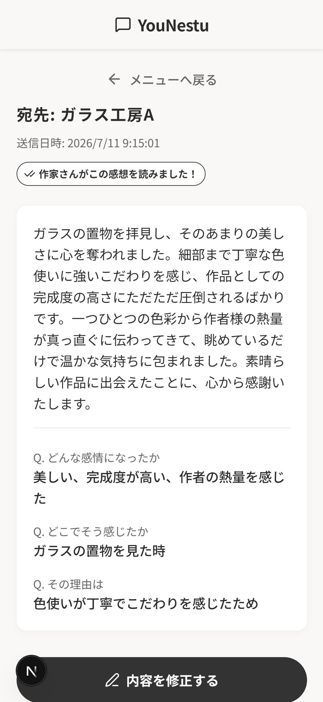
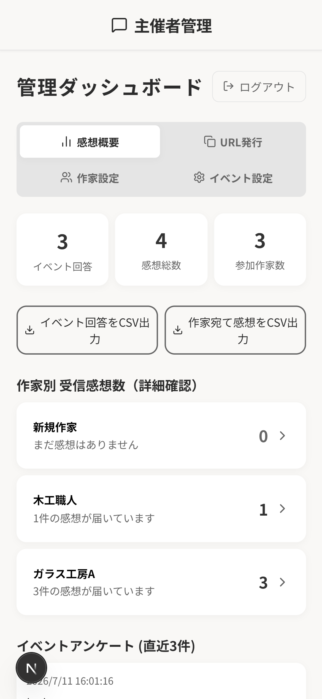
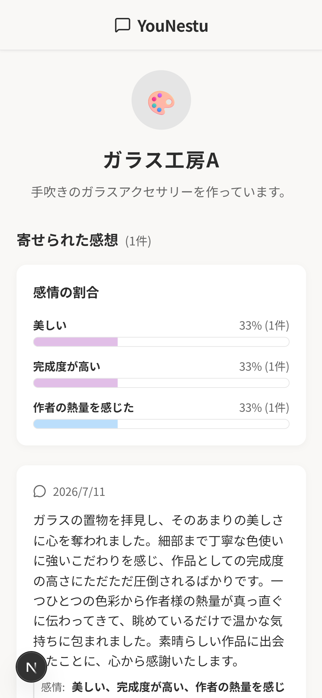

# 🎨 YouNetsu (イベント向け 感想共有アプリ)

本プロジェクトは、イベント会場で来場者が作家（クリエイター）へ感想を送信する際、AI（Gemini API）や定型文を用いてベースとなる文章を自動生成し、心理的ハードルを下げて想いを届けるためのWebアプリケーションです。

## 💡 コンセプト・開発の背景

**「伝えたい想いがあるのに、言語化の負荷で諦めてしまう」課題を解決する**

作者にとって感想は大きなモチベーションになります。しかし、事前のアンケート調査において、**「感想を伝えたかったが諦めた経験がある」という声が大多数**を占め、**多くの方が「いいね等の簡易的な反応」に留まっている**という「想いと行動の乖離」が明らかになりました。

調査から見えてきた主な課題は以下の2点です：
1. **閲覧者（来場者）側の「推敲負荷」**: 感情はあるが理由を言語化できない、的外れで失礼にならないか不安という心理的ハードルが行動を阻害している。
2. **作者側の「管理コスト」**: 感想を集めたいが、アンケート作成や管理に割く作業時間の確保が難しい。

本システムは、これらの「作者と閲覧者間の感想の収集と送信に関する作業コスト」を削減し、双方が無理なく使える仕組みの実現を目指して開発されました。

## ✨ 課題解決のアプローチ

- **閲覧者の推敲負荷を最小化する入力アシスト**
  「感情」「場所」「理由」の3軸で直感的に選択・入力できる形式を構築。選択データをもとに**AI（Gemini）または定型文で丁寧な文章のベースを自動生成し、最後にユーザー自身が微調整できる設計**にすることで、一から書き起こす負担や「失礼にならないか」という不安を取り除きます。
- **作者の収集・管理コストを最小化する自動生成**
  最小限の項目を入力するだけで、会場掲示用のQRコードや専用URLを即時自動生成。作者専用の画面で感想を一元管理・閲覧できる仕組みを整えました。

> **🔬 プロジェクトの位置づけ（実証実験・PoC）**
> 本プロジェクトは卒業研究の一環として開発されたデモアプリです。**「利用者の潜在的な負荷を取り除く仕組みが、実際の現場で有効に機能するか」**を検証するための実証実験（PoC）ツールとして位置づけており、今後は実際の展示イベント(緑市 7/12~7/19)で運用し、改善を進める予定です。

---
## 📸 スクリーンショット（UIイメージ）


1. 来場者の入力画面  
   
     
   閲覧者が感想を送るまでの動画  
   https://github.com/user-attachments/assets/bfb1a998-4112-4e1b-bc58-b3cb0c30bab9

3. 管理画面のダッシュボード  
   

5. 作家さん用閲覧ページ  
   

---

## ✨ 主な機能

- **来場者向けフォーム**: 感情（ワクワクした、感動した等）を選択し、場所や理由を直感的に入力できるフォーム。
- **AI・定型文による文章整形**: 質問内容から感想を、Gemini APIや定型文を用いて丁寧な文章に自動整形。
- **作家専用ページ**: 作家ごとに発行される専用URLから、自分宛ての感想一覧や「感情の割合グラフ」を閲覧可能（既読機能つき）。
- **管理ダッシュボード**: イベント主催者向けの管理画面。参加作家の登録、QRコードのダウンロード、アンケート結果のCSV出力機能。

## 🛠 技術スタック

- **Frontend**: Next.js (App Router), React, TypeScript
- **Styling**: CSS (Vanilla, Glassmorphism design), Lucide React (Icons)
- **Backend / Database**: Supabase (PostgreSQL, Auth, Storage)
- **AI Integration**: Google Gemini API

## 🚀 ローカル環境での起動方法

### 1. 必要な環境変数の設定
プロジェクトのルートディレクトリに `.env` ファイルを作成し、以下の情報を記述してください。

```env
# Supabase
NEXT_PUBLIC_SUPABASE_URL=your_supabase_project_url
NEXT_PUBLIC_SUPABASE_ANON_KEY=your_supabase_anon_key

# Gemini AI
GEMINI_API_KEY=your_gemini_api_key
```

### 2. パッケージのインストール
```bash
npm install
```

### 3. 開発サーバーの起動
```bash
npm run dev
```

ブラウザで `http://localhost:3000` にアクセスしてください。

---

## 📝 開発メモ

- 当初は `React + Vite` で開発を開始しましたが、APIの秘匿化やSSRの必要性から `Next.js` に移行しました。
- 認証には Supabase Auth を使用し、Middleware（`proxy.ts`）で管理画面（`/admin`）のルートガードを行っています。
